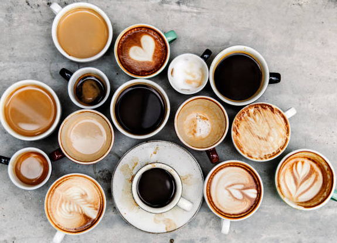

## Welcome to Coffeepedia!

### Background
Coffee is one of the most commonly consumed commodities across the globe. You can easily find a line of people in a coffee shop in the morning starting their day with cup of coffee. You can find coffee almost anywhere--coffee shops, restaurants, grocery stores, and offices. People often meet over coffee--it helps build relationships and brings people together. But, what do we really know about coffee? Where is it grown? Who consumes the most? What flavor and aroma attributes make different coffees unique? Look no further, you will find your answers here!

### Guideline
In this site, you will find the following information on various tabs.

1) Landing Page
Here you will find a word cloud of flavor and aroma attributes used to describe coffee. The larger the words are, the more often they are used to describe coffee.

2) Map Page
You will find Arabica production, Robusta production, and coffee consumption across the world in 2019. The larger the circles are, the higher the consumption or production for that country. You can toggle between different map styles, and check and uncheck the production and consumption layers to show and hide the data. The map illustrates the narrow band around the globe with the most optimal climate for growing coffee plants. This band is often referred to as "The Coffee Belt."

3) Data Page
You will find a data table of coffee commodity data from 2015 to 2019 for 82 coffee-producing countries, and 19 commodity attributes. Filter the table with the dropdown menus to explore our data set provided by the USDA Foreign Agricultural Service.

4) Attributes Page
You will find bubble charts displaying the coffee commodity data. There are 6 buttons across the toolbar for Arabica Production, Robusta Production, Total Production, Domestic Consumption, Import and Exports. Click a button to generate a bubble chart and hover over each bubble to display the country name and attribute value. The size of the bubble corresponds to the attribute value.

5) Flavor Page
You will find data table with coffee aroma/flavor that describes coffee. It inclues attributes, definitions, and aroma/flavor descriptions. You can type a flavor in a search bar, sort the columns, and toggle thru pages to explore this flavor data set.

6) Trend Page
You will find stream charts that display global Arabica Production and Robusta Production from 2001 to 2020. Hover your cursor over each data point to reveal the country, year and value.

7) Who We Are Page
You will find coffee hunters who put the data together here! 

## Enjoy your coffee!
